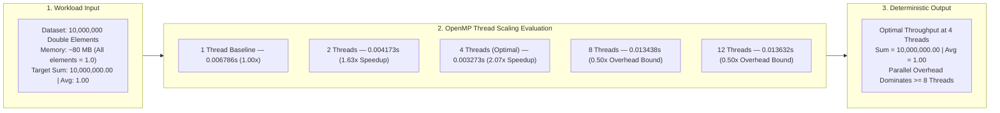
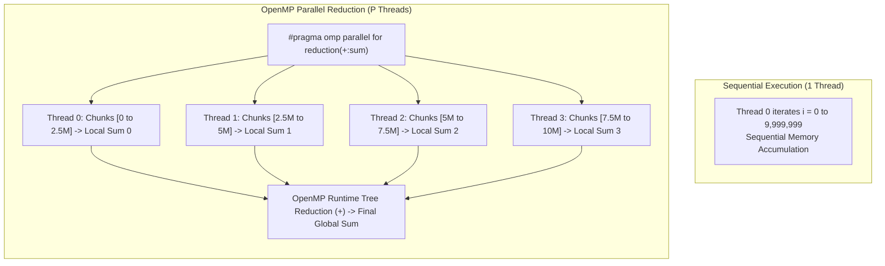

# Parallel Sum and Average Using OpenMP

[](#)
[](#)
[](#)
[](#)

---

## Executive Summary

This repository contains the implementation, execution analysis, and empirical benchmark results for calculating the **Sum and Average of a Large Dataset (10,000,000 elements)** using multi-threaded shared-memory parallelism with **OpenMP**. The experiment investigates the impact of thread scaling ($1, 2, 4, 8,$ and $12$ threads) on execution time and speedup.



### Key Finding

> **Execution achieved its peak speedup of 2.07× on 4 threads (reducing execution time from 0.006786s down to 0.003273s). Beyond 4 threads (at 8 and 12 threads), execution time increased to ~0.0135s (0.50× relative speedup), demonstrating that for memory-bound millisecond-level workloads, thread synchronization and memory bus contention overhead exceed the benefits of additional cores.**

---


## 1. Experiment Objectives

1. **Parallel Loop Decomposition**: Distribute a uniform accumulation loop of 10 million elements across multiple concurrent CPU threads using OpenMP.
2. **Race-Free Parallel Accumulation**: Eliminate data race hazards on shared sum accumulators using the OpenMP `reduction(+:sum)` clause.
3. **Execution Runtime Benchmarking**: Accurately capture kernel execution time using `omp_get_wtime()` across varying thread counts ($1, 2, 4, 8,$ and $12$ threads).
4. **Speedup & Scalability Analysis**: Quantify speedup scaling and identify the physical threshold where thread management overhead outweighs parallel computational gain.

---

## 2. Theoretical & Architectural Comparison



### Architectural Breakdown

#### 1. Sequential Execution (Single Thread)
A single execution thread processes all $10^7$ iterations linearly. While memory access is strictly contiguous and cache-friendly, processing throughput is throttled by the instructions-per-cycle (IPC) limit of a solitary CPU core.

#### 2. OpenMP Parallel Work-Sharing (`#pragma omp parallel for`)
Loop iterations are divided dynamically or statically into non-overlapping index chunks across the thread team. Each worker core operates on a distinct partition of the 80 MB dataset simultaneously.

#### 3. Thread-Safe Parallel Reduction (`reduction(+:sum)`)
Without reduction, multiple threads attempting concurrent writes to a shared `sum` variable trigger a **critical race condition**, leading to non-deterministic data corruption. The `reduction(+:sum)` directive:
- Provisions private per-thread accumulators initialized to `0.0`.
- Executes thread-local partial summations without locking or synchronization stalls.
- Combines partial accumulators atomically into the final shared `sum` at the parallel barrier.

```
+-----------------------------------------------------------------------------+
|                           OPENMP REDUCTION ARCHITECTURE                     |
+-----------------------------------------------------------------------------+
| Dataset (10,000,000 elements)                                               |
|        |                                                                    |
|   ┌────┴───────────────┬───────────────────┬───────────────────┐            |
|   ↓                    ↓                   ↓                   ↓            |
| Thread 0            Thread 1            Thread 2            Thread 3        |
| Local Sum = 2.5M    Local Sum = 2.5M    Local Sum = 2.5M    Local Sum = 2.5M|
|   └────┬───────────────┴───────────────────┴───────────────────┘            |
|        ↓                                                                    |
| Atomic Tree Reduction (+)                                                   |
|        ↓                                                                    |
| Final Global Sum = 10,000,000.00 (Average = 1.00)                           |
+-----------------------------------------------------------------------------+
```

---

## 3. Workload Specification

- **Dataset Size ($N$)**: $10,000,000$ elements (`double`)
- **Memory Allocation**: $10,000,000 \times 8\text{ bytes} \approx \mathbf{80\text{ MB}}$
- **Element Value**: $1.0$ for all indices $i \in [0, N-1]$
- **Mathematical Invariant & Target Results**:
  $$\text{Target Sum} = \sum_{i=0}^{N-1} 1.0 = \mathbf{10,000,000.00}$$
  $$\text{Target Average} = \frac{\text{Sum}}{N} = \frac{10,000,000.00}{10,000,000} = \mathbf{1.00}$$
- **Timing Interval**: Exclusively encapsulates the parallel reduction loop via `omp_get_wtime()`.

---

## 4. Source Code References

All source code is located in the [`src/`](src/) directory:

| Program | Source File Link | Key Directives & Implementation Details |
| :--- | :--- | :--- |
| **OpenMP Parallel Sum & Average** | [`src/parallel_sum.c`](src/parallel_sum.c) | `#pragma omp parallel for reduction(+:sum)`, `omp_get_wtime()`, `omp_get_max_threads()` |

---

## 5. Empirical Results & Screenshots

### 5.1 Environment Setup & GCC Compilation
System CPU core verification (`nproc` reporting 12 logical cores) and compilation with `-O2 -fopenmp`.


---

### 5.2 Thread Scaling: Default, 1, 2, and 4 Threads
Demonstration of execution scaling from 1 thread down to the optimal runtime at 4 threads.


---

### 5.3 Thread Scaling: 8 and 12 Threads
Demonstration of execution runtime increasing at higher thread counts due to parallel management overhead.


---

## 6. Performance Comparison & Visualizations

### 6.1 Empirical Benchmark Table

| Thread Count ($P$) | Execution Time (s) | Speedup Factor ($S$) | Parallel Efficiency ($E$) | Performance State |
| :---: | :---: | :---: | :---: | :--- |
| **1 Thread** | `0.006786 s` | **1.00×** | **100.00%** | Single-threaded baseline reference |
| **2 Threads** | `0.004173 s` | **1.63×** | **81.50%** | Near-linear dual-thread speedup |
| **4 Threads** | **`0.003273 s`** | **2.07×** | **51.75%** | **Optimal Performance Peak (Fastest)** |
| **8 Threads** | `0.013438 s` | **0.50×** | **6.25%** | Parallel overhead bound (Slowdown) |
| **12 Threads** | `0.013632 s` | **0.50×** | **4.17%** | Memory bandwidth & synchronization bottleneck |

$$\text{Speedup } (S) = \frac{T_1}{T_p}, \quad \text{Efficiency } (E) = \frac{S}{P} \times 100\%$$

---

### 6.2 Performance Comparison Visualizations

#### Combined Execution Time & Speedup Overview
Side-by-side comparison illustrating execution runtime minimization at 4 threads and the corresponding speedup curve.


#### Standalone Scaling Plots
| Execution Time vs. Threads | Speedup Factor vs. Threads |
| :---: | :---: |
|  |  |

---

## 7. Technical Analysis & Discussion

### Why is 4 Threads the Optimal Point?
In theoretical computing, doubling thread counts is expected to double execution speed. However, empirical benchmarking reveals an optimal inflection point at **4 threads**:

1. **Extremely Low Computational Granularity**:
   The inner loop performs a single floating-point addition per element. Total baseline runtime on 1 thread is only **6.78 milliseconds**. The computational phase finishes so quickly that the time spent spawning, scheduling, and synchronizing threads constitutes a significant fraction of total execution.
2. **Memory Bus & Bandwidth Saturation**:
   Streaming an 80 MB array requires continuous data throughput from system RAM into L1/L2/L3 caches. As thread count increases to 8 and 12, memory controller channels saturate under concurrent cache-line fetch requests, forcing CPU cores into memory stall states.
3. **OpenMP Reduction Overhead at Higher Threads**:
   At 8 and 12 threads, the runtime cost of creating thread teams, coordinating thread barriers, and executing the hierarchical reduction tree outweighs the minor parallel compute benefit.
4. **Key Takeaway**:
   *Increasing thread counts does not guarantee proportional performance gains. Workload granularity and memory bandwidth dictate the optimal parallel concurrency level.*

---

## 8. Conclusion & Engineering Takeaways

1. **Correctness Guaranteed via Reduction**: The `reduction(+:sum)` clause prevented race hazards and delivered deterministic mathematical accuracy across all thread configurations ($\text{Sum} = 10,000,000.00, \text{Avg} = 1.00$).
2. **Optimal Concurrency Identification**: 4 threads provided the optimal execution time of **`0.003273 seconds`** (**2.07× speedup**).
3. **Overhead Threshold**: For fast memory-bound reduction loops, excessive thread counts (8 and 12) introduce context switching and synchronization overhead that reduces overall throughput.
